# Multi-Container Runtime

## 1. Team Information

- Team Member 1: Devansh Gupta - PES1UG24CS145

## 2. Build, Load, and Run Instructions

### Environment

- The assignment brief was written for Ubuntu 22.04/24.04 in a VM
- The commands below were verified on CachyOS and match the screenshots captured for this submission
- Root privileges are required for namespace setup, `chroot`, `/proc` mounting, and module load or unload

### Install Dependencies on CachyOS

```bash
sudo pacman -S --needed base-devel clang wget
sudo pacman -S --needed linux-cachyos-headers
```

If your system uses a different CachyOS kernel flavor, install the matching headers package for that kernel.

### Build and Preflight

From the repository root:

```bash
make -C boilerplate ci
make -C boilerplate
```

Optional preflight:

```bash
cd boilerplate
chmod +x environment-check.sh
sudo ./environment-check.sh
cd ..
```

### Prepare the Alpine Root Filesystem

```bash
mkdir -p rootfs-base
wget https://dl-cdn.alpinelinux.org/alpine/v3.20/releases/x86_64/alpine-minirootfs-3.20.3-x86_64.tar.gz
tar -xzf alpine-minirootfs-3.20.3-x86_64.tar.gz -C rootfs-base
cp boilerplate/cpu_hog rootfs-base/
cp boilerplate/io_pulse rootfs-base/
cp boilerplate/memory_hog rootfs-base/
```

Create fresh writable rootfs copies as needed for each run:

```bash
cp -a rootfs-base rootfs-alpha
cp -a rootfs-base rootfs-beta
cp -a rootfs-base rootfs-log
cp -a rootfs-base rootfs-ipc
cp -a rootfs-base rootfs-soft2
cp -a rootfs-base rootfs-hard2
cp -a rootfs-base rootfs-hi5
cp -a rootfs-base rootfs-lo5
```

### Load the Kernel Module and Start the Supervisor

```bash
sudo insmod boilerplate/monitor.ko
ls -l /dev/container_monitor
sudo ./boilerplate/engine supervisor ./rootfs-base
```

The supervisor remains in Terminal 1 and serves CLI requests over `/tmp/mini_runtime.sock`.

### CLI Commands Used in the Demo

Start background containers:

```bash
sudo ./boilerplate/engine start alpha ./rootfs-alpha "/cpu_hog 120" --soft-mib 48 --hard-mib 128 --nice 0
sudo ./boilerplate/engine start beta ./rootfs-beta "/io_pulse 300 200" --soft-mib 48 --hard-mib 128 --nice 0
```

Inspect tracked containers:

```bash
sudo ./boilerplate/engine ps
```

Inspect logs:

```bash
sudo ./boilerplate/engine logs logger
sudo tail -n 20 logs/logger.log
```

Stop a running container:

```bash
sudo ./boilerplate/engine stop ipc
```

### Exact Run Sequence Used for the Screenshots

Screenshot 1:

```bash
sudo ./boilerplate/engine start alpha ./rootfs-alpha "/cpu_hog 30" --soft-mib 48 --hard-mib 128 --nice 0
sudo ./boilerplate/engine start beta ./rootfs-beta "/io_pulse 60 200" --soft-mib 48 --hard-mib 128 --nice 0
sudo ./boilerplate/engine ps
```

Screenshot 2:

```bash
sudo ./boilerplate/engine start alpha ./rootfs-alpha "/cpu_hog 120" --soft-mib 48 --hard-mib 128 --nice 0
sudo ./boilerplate/engine start beta ./rootfs-beta "/io_pulse 300 200" --soft-mib 48 --hard-mib 128 --nice 0
sudo ./boilerplate/engine ps
```

Screenshot 3:

```bash
cp -a rootfs-base rootfs-log
sudo ./boilerplate/engine start logger ./rootfs-log "/io_pulse 120 200" --soft-mib 48 --hard-mib 128 --nice 0
sudo ./boilerplate/engine ps
sudo ./boilerplate/engine logs logger
sudo tail -n 20 logs/logger.log
```

Screenshot 4:

```bash
sudo ./boilerplate/engine ps
sudo ./boilerplate/engine stop logger
cp -a rootfs-base rootfs-ipc
sudo ./boilerplate/engine start ipc ./rootfs-ipc "/cpu_hog 60" --soft-mib 48 --hard-mib 128 --nice 0
sudo ./boilerplate/engine stop ipc
```

Screenshot 5:

```bash
cp -a rootfs-base rootfs-soft2
sudo ./boilerplate/engine start softwarn2 ./rootfs-soft2 "/memory_hog 8 1000" --soft-mib 24 --hard-mib 256 --nice 0
sleep 4
sudo ./boilerplate/engine ps
sudo dmesg | tail -n 30
```

Screenshot 6:

```bash
cp -a rootfs-base rootfs-hard2
sudo ./boilerplate/engine start hardkill2 ./rootfs-hard2 "/memory_hog 8 500" --soft-mib 24 --hard-mib 40 --nice 0
sleep 4
sudo ./boilerplate/engine ps
sudo dmesg | tail -n 30
```

Screenshot 7:

```bash
rm -f hi5.out lo5.out
cp -a rootfs-base rootfs-hi5
cp -a rootfs-base rootfs-lo5

( start=$(date +%s.%N); sudo ./boilerplate/engine run hi5 ./rootfs-hi5 "/cpu_hog 20" --nice 0; end=$(date +%s.%N); awk -v s="$start" -v e="$end" 'BEGIN { printf "hi elapsed=%.3f sec\n", e-s }' ) > hi5.out 2>&1 &
( start=$(date +%s.%N); sudo ./boilerplate/engine run lo5 ./rootfs-lo5 "/cpu_hog 20" --nice 10; end=$(date +%s.%N); awk -v s="$start" -v e="$end" 'BEGIN { printf "lo elapsed=%.3f sec\n", e-s }' ) > lo5.out 2>&1 &
wait
cat hi5.out
cat lo5.out
```

Screenshot 8:

```bash
pgrep -af "/boilerplate/engine" || echo "no engine processes"
ps -ef | grep "[d]efunct" || echo "no defunct processes"
sudo rmmod monitor
test -e /dev/container_monitor && ls /dev/container_monitor || echo "/dev/container_monitor removed"
```

### Cleanup

Stop the supervisor with `Ctrl+C`, then verify teardown:

```bash
pgrep -af "/boilerplate/engine" || echo "no engine processes"
ps -ef | grep "[d]efunct" || echo "no defunct processes"
sudo rmmod monitor
test -e /dev/container_monitor && ls /dev/container_monitor || echo "/dev/container_monitor removed"
```

## 3. Demo with Screenshots

### Screenshot 1 - Multi-container Supervision

Caption: Two containers, `alpha` and `beta`, are running under one long-lived supervisor process.

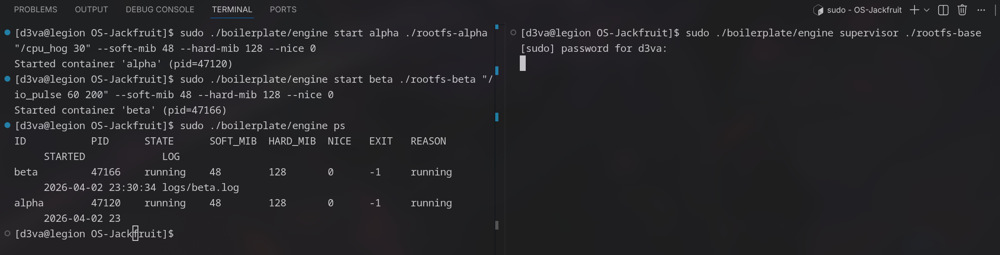

### Screenshot 2 - Metadata Tracking

Caption: `engine ps` shows container ID, PID, state, limits, exit status, reason, start time, and log path.

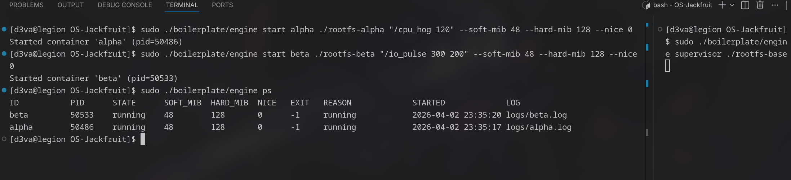

### Screenshot 3 - Bounded-Buffer Logging

Caption: `engine logs logger` and `logs/logger.log` both show container output captured through the supervisor logging pipeline.

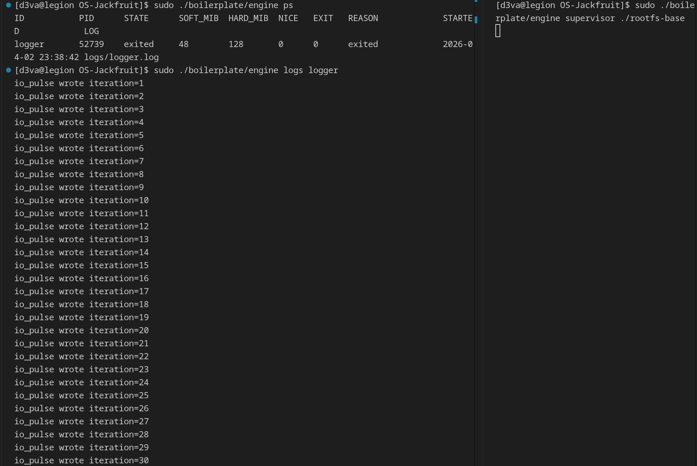
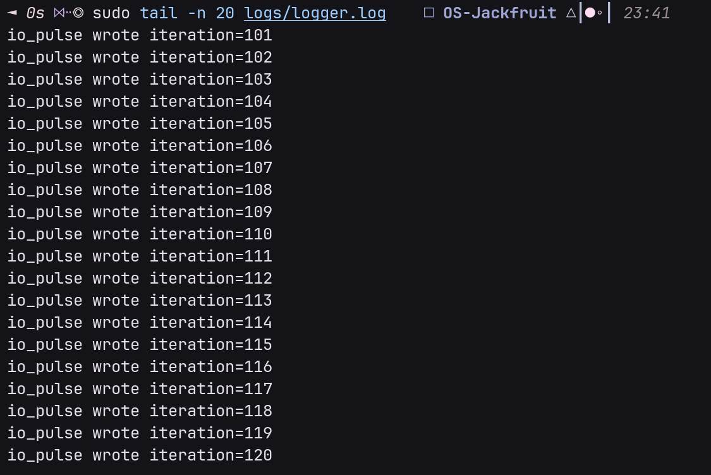

### Screenshot 4 - CLI and IPC

Caption: A client CLI command reaches the running supervisor over the UNIX domain socket control channel and receives a response.

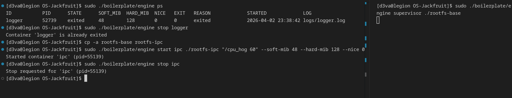

### Screenshot 5 - Soft-Limit Warning

Caption: `softwarn2` is still running in supervisor metadata while kernel logs report the soft-limit warning event.

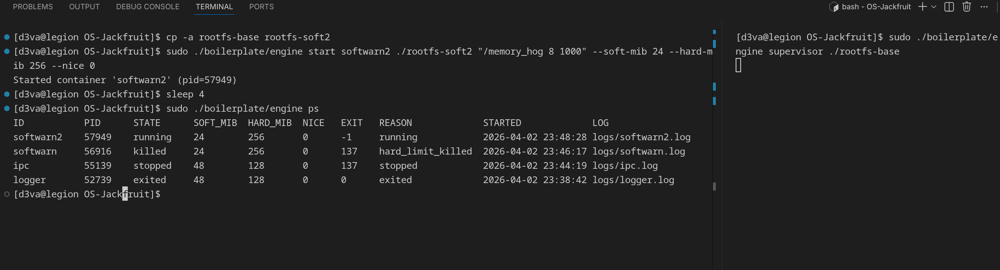
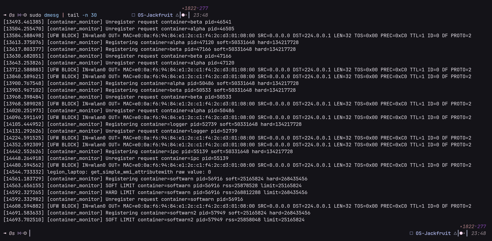

### Screenshot 6 - Hard-Limit Enforcement

Caption: `hardkill2` is killed after crossing the hard limit, and supervisor metadata records `hard_limit_killed`.

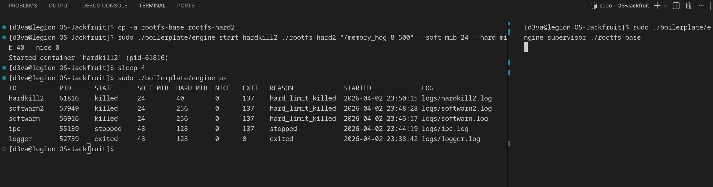
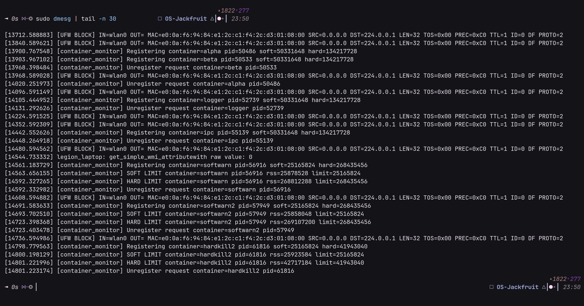

### Screenshot 7 - Scheduling Experiment

Caption: Two concurrent CPU-bound containers with different `nice` values complete with measured elapsed times of `19.718 sec` for `hi5` and `19.761 sec` for `lo5`.

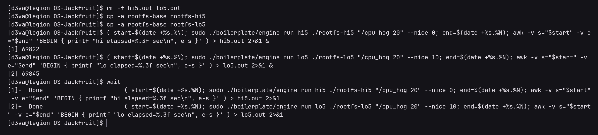
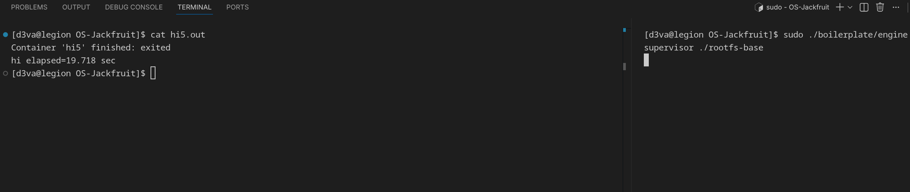
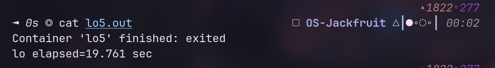

### Screenshot 8 - Clean Teardown

Caption: The supervisor is gone, no defunct processes remain, and `/dev/container_monitor` is removed after module unload.

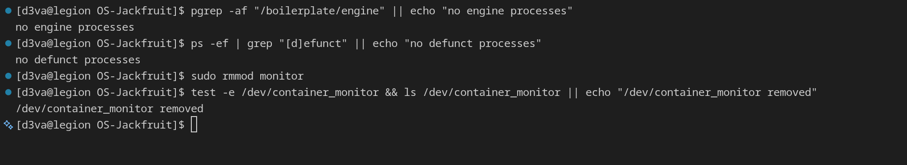

## 4. Engineering Analysis

### Isolation Mechanisms

Each container is created with `clone()` using `CLONE_NEWPID`, `CLONE_NEWUTS`, and `CLONE_NEWNS`, so the child gets an isolated PID namespace, hostname namespace, and mount table. The child then marks mounts private, enters its assigned root filesystem with `chroot()`, switches to `/`, and mounts a fresh `/proc`. This isolates process visibility and the filesystem view, while the host kernel, scheduler, and physical memory are still shared across all containers.

### Supervisor and Process Lifecycle

The long-running supervisor centralizes metadata, logging, and signal handling for all containers. Short-lived CLI clients send `start`, `run`, `ps`, `logs`, and `stop` requests over a UNIX domain socket, which keeps shared state in exactly one process. `SIGCHLD` drives reaping with `waitpid(..., WNOHANG)`, so child exits do not leave zombies. The stored metadata lets the runtime distinguish normal exit, manual stop, generic signal termination, and `hard_limit_killed`.

### IPC, Threads, and Synchronization

The runtime uses two IPC paths. The control path is a UNIX domain socket between the CLI client and the supervisor. The logging path is a pipe from each container's `stdout` and `stderr` into the supervisor. Each container has a producer thread that reads from its pipe and pushes fixed-size entries into a bounded circular buffer. A consumer thread removes entries and appends them to `logs/<id>.log`. The log buffer uses one mutex and two condition variables to avoid overflow, underflow, corruption, and deadlock, while container metadata is protected by a separate mutex to avoid races between CLI operations, logger threads, and child reaping.

### Memory Management and Enforcement

The kernel module tracks host PIDs in a linked list and periodically checks RSS. RSS counts resident physical pages currently mapped into the process, but it does not measure the entire virtual address space or all kernel-side memory cost. The soft limit is an observability threshold, so the kernel logs a warning the first time the process crosses it. The hard limit is an enforcement threshold, so the kernel sends a terminating signal when the process exceeds it. This policy belongs in kernel space because only the kernel has authoritative and timely visibility into process memory usage.

### Scheduling Behavior

The scheduling experiment ran two CPU-bound workloads concurrently with different `nice` values. The `nice 0` run (`hi5`) finished in `19.718 sec`, while the `nice 10` run (`lo5`) finished in `19.761 sec`. The higher-priority task completed slightly earlier, which is consistent with CFS giving it a somewhat larger share of CPU time. The observed gap is small because both jobs were short, identical CPU-bound runs on the same machine, so the scheduler had limited time to magnify the priority difference.

## 5. Design Decisions and Tradeoffs

### Namespace Isolation

- Design choice: `clone()` with PID, UTS, and mount namespaces plus `chroot()`
- Tradeoff: `chroot()` is simpler than `pivot_root()`, but it is a weaker filesystem jail
- Justification: it satisfies the assignment requirements with less implementation complexity

### Supervisor Architecture

- Design choice: one long-lived supervisor with short-lived CLI clients
- Tradeoff: it requires IPC and synchronized shared metadata
- Justification: it cleanly supports multi-container lifecycle management and a reusable command interface

### IPC and Logging

- Design choice: UNIX domain socket for control plus pipe-based logging into a bounded buffer
- Tradeoff: this adds thread management and queue synchronization compared with direct file writes
- Justification: it clearly demonstrates two different IPC mechanisms and producer-consumer coordination

### Kernel Monitor

- Design choice: character device plus `ioctl` registration and timer-driven RSS checks
- Tradeoff: periodic sampling is simple but not instantaneous
- Justification: it keeps the user-kernel contract small while still supporting soft warnings and hard kills

### Scheduling Experiment

- Design choice: reusable workload binaries with `nice` as the scheduling control
- Tradeoff: `nice` changes weight, but it does not expose every scheduler knob
- Justification: it is simple to reproduce and directly tied to Linux fairness behavior

## 6. Scheduler Experiment Results

| Experiment | Workloads | Configuration | Measurement | Observation |
| --- | --- | --- | --- | --- |
| CPU vs CPU | `hi5` vs `lo5` using `cpu_hog 20` | `nice 0` vs `nice 10` | `hi5 = 19.718 sec`, `lo5 = 19.761 sec`, delta `0.043 sec` | The lower `nice` value finished slightly earlier, which matches the expected CFS priority bias, but the gap is small because both tasks were short and otherwise identical |

Raw terminal outputs captured for this run:

```text
Container 'hi5' finished: exited
hi elapsed=19.718 sec

Container 'lo5' finished: exited
lo elapsed=19.761 sec
```
